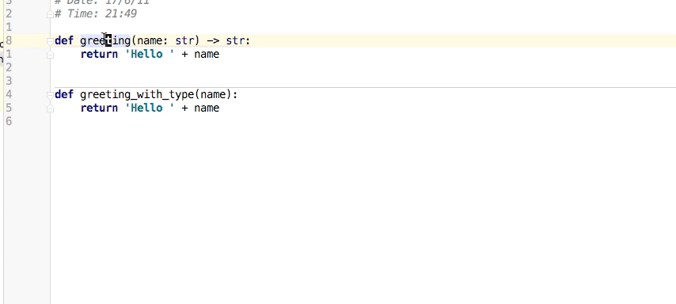

# README
---

Using intellij to infer Python typing and

add type comments using the `typing` module.

See more from https://www.jetbrains.com/help/pycharm/2017.1/type-hinting-in-pycharm.html

---

Move cursor to the element, and press `ctrl shift Y`  to add the type comments.

